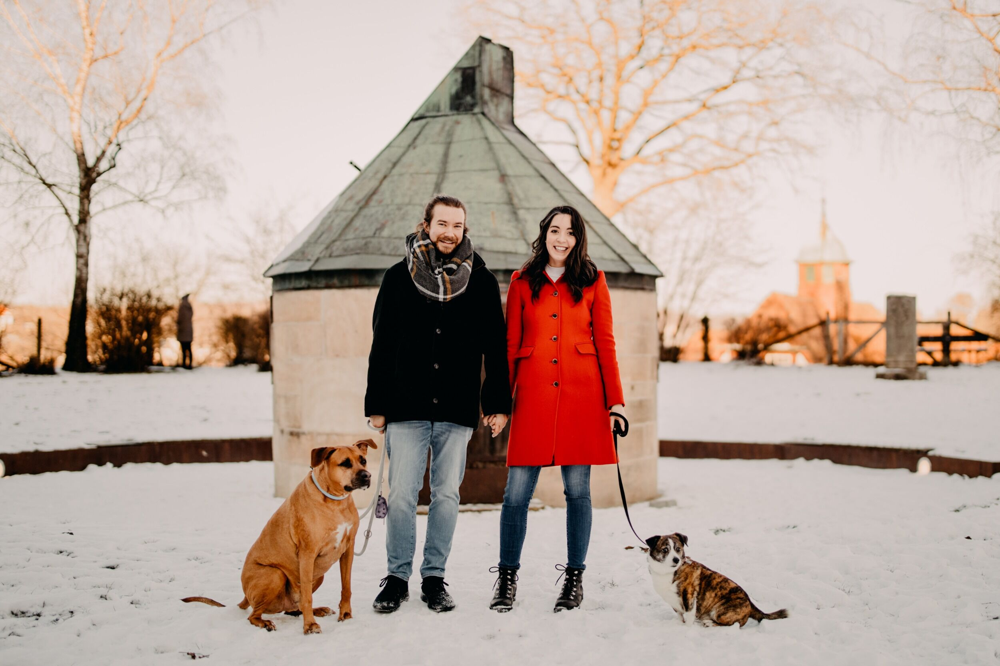



<strong>Professional</strong> 
I am currently the Head of Research at [Element Finance](https://element.fi), where I investigate new mathematics and machine learning approaches for decentralized finance.
Before that, I was a Machine Learning Researcher at [Weights & Biases](https://wandb.ai/site).
Prior to entering industry, I was a Postdoctoral researcher in [Matthias Bethge's lab](http://bethgelab.org) at the University of T&uuml;bingen in Germany.
I received my Ph.D. in Vision Science with Dr. Bruno Olshausen at the [Redwood Center for Theoretical Neuroscience](http://redwood.berkeley.edu/), University of California, Berkeley.
I got my start as a computational neuroscientist in [Gar Kenyon's group](http://petavision.github.io/petavision.html) at [Los Alamos National Laboratory](https://youtu.be/55hlnlVuTpk), where I worked as a post-baccalaureate researcher for two years.
I received a Bachelor of Science degree in Electrical Engineering with a minor in Optical Sciences from the [New Mexico Institute of Mining and Technology](https://www.nmt.edu/academics/eleceng/).
I graduated from Rio Rancho High School in 2007.

<strong>Personal</strong> 
I was born in [Maine, USA](https://youtu.be/witphg3HUlE) and lived there until I was 10.
I spent the rest of my adolescence in Rio Rancho, a town in central [New Mexico, USA](https://explorepartsunknown.com/destination/new-mexico/).
When I'm not working I love playing outside, especially ultimate frisbee, disc golf, snowboarding, and hiking.
I am also a gamer; I play all sorts of games, from video games to tabletop.
And these things are always most fun when done with my partner, Christine, and our dog [Ramsey](https://www.instagram.com/ramseythepup/) (our late dog Barley is also pictured above).

 
<strong>Here is a bio for talks:</strong>
 
Dylan received his Bachelor of Science degree in Electrical Engineering from the New Mexico Institute of Mining and Technology.
He then worked as a post-baccalaureate researcher in Dr. Garrett Kenyon's group at Los Alamos National Lab, where he studied biophysical retina models and hierarchical sparse coding networks.
He obtained his PhD in Vision Science from the University of California, Berkeley and was advised by Dr. Bruno Olshausen.
For his PhD thesis he developed an analysis technique to explain selectivity and robustness properties of a sparse coding neural network.
Currently, he is a Postdoctoral researcher in Dr. Matthias Bethge's lab at the University of Tübingen.
He is extending his PhD thesis work to discover novel modes of invariance and selectivity in biological neurons.
He is also supervising students working in the fields of disentanglement and adversarial robustness.
